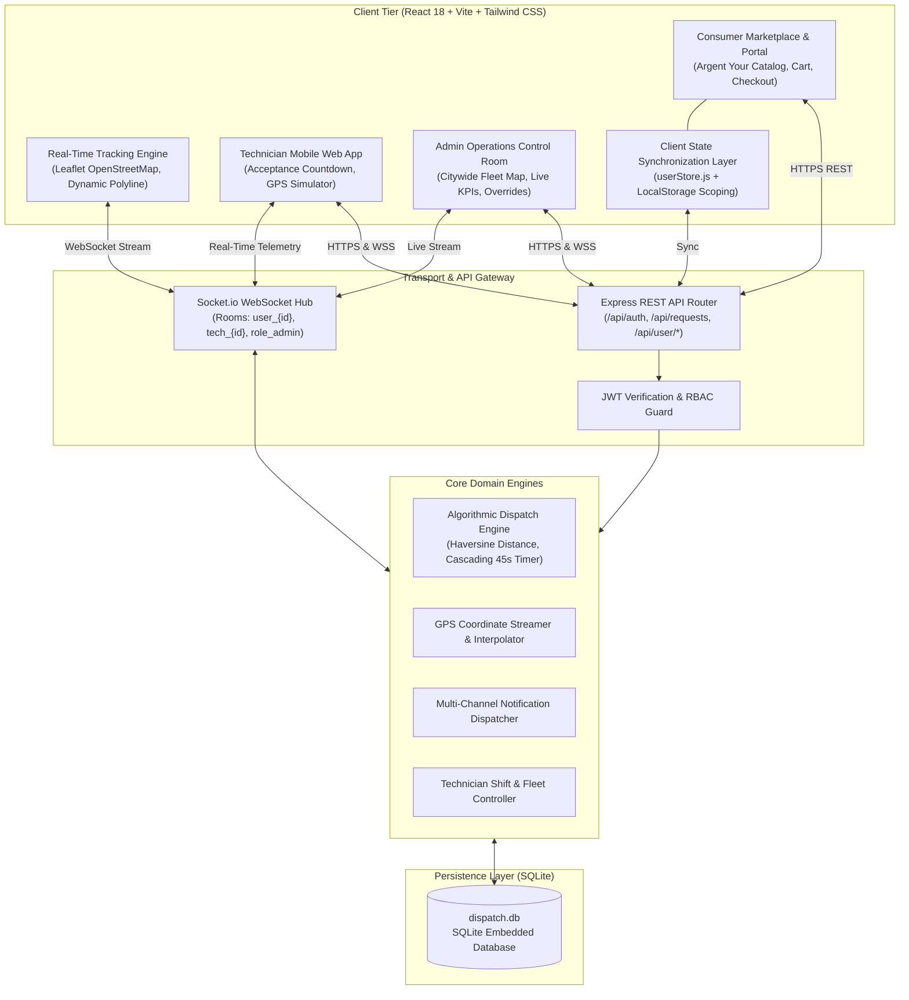
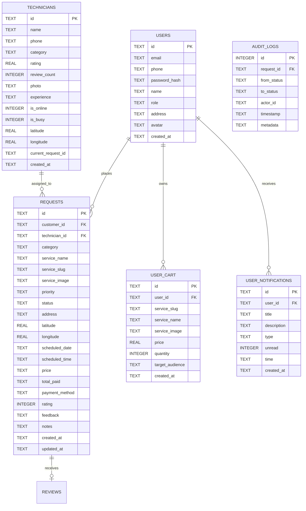
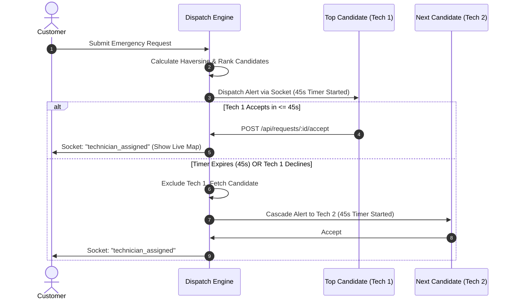

# 🏛️ System Architecture & Technical Specifications

**Project Name:** Argent Your / Emergency Home Services Auto-Dispatch System  
**Document Version:** 2.0.0  
**Status:** Implemented & Grounded  
**Last Updated:** September 2026  

---

## 1. High-Level Architecture

The system employs a client-server architecture centered around a low-latency event bus and persistent relational storage.

---

## 2. Technology Stack

| Layer | Technologies / Libraries | Rationale & Responsibility |
| :--- | :--- | :--- |
| **Frontend Framework** | React 18, Vite | High-performance reactive rendering with sub-second hot module reloading. |
| **Styling & Design** | Tailwind CSS, Lucide React, Glassmorphism | Custom design system with modern glassmorphism, responsive utility classes, and crisp vector icons. |
| **Mapping & GIS** | Leaflet, React-Leaflet, OpenStreetMap | Lightweight map rendering without expensive proprietary API billing; supports custom vehicle markers and polylines. |
| **Client State** | Context API (`AuthContext`), `userStore.js` | Zero-fake data architecture; stores cart, orders, addresses, and notifications scoped per authenticated user ID. |
| **Backend Runtime** | Node.js (v18+ / v20+), Express.js | Non-blocking I/O runtime optimal for concurrent telemetry streaming and API handling. |
| **Real-time Comms** | Socket.io (WebSocket with HTTP long-polling fallback) | Bidirectional event streaming for vehicle coordinates, emergency alerts, and status transitions. |
| **Database** | SQLite3 (`sqlite3` / `better-sqlite3`, `dispatch.db`) | ACID-compliant embedded relational database with zero-setup serverless overhead and instant transactional performance. |
| **Security & Auth** | JSON Web Tokens (`jsonwebtoken`), `bcryptjs` | Stateless session management with salted password hashing and role-based guards. |

---

## 3. Database Schema & Data Modeling

The relational database is persisted in `server/dispatch.db`.

---

## 4. Algorithmic Auto-Dispatch Engine Architecture

When an emergency or doorstep service is requested, the **Auto-Dispatch Engine** follows a deterministic multi-stage evaluation pipeline:

### 4.1 Candidate Filtering Pipeline
A technician candidate $T$ is eligible for request $R$ if and only if:
$$\text{Eligible}(T, R) \iff \begin{cases}
T.\text{category} = R.\text{category} \\
T.\text{is\_online} = 1 \\
T.\text{is\_busy} = 0 \\
T.\text{id} \notin \text{DeclinedCandidates}(R)
\end{cases}$$

### 4.2 Distance & Travel ETA Modeling
Distance is calculated using the spherical Law of Cosines / Haversine formula over Earth radius $R_E = 6371\text{ km}$:
$$\Delta \phi = \text{lat}_R - \text{lat}_T, \quad \Delta \lambda = \text{lon}_R - \text{lon}_T$$
$$d(T, R) = 2 R_E \arcsin\left(\sqrt{\sin^2\left(\frac{\Delta \phi}{2}\right) + \cos(\text{lat}_T)\cos(\text{lat}_R)\sin^2\left(\frac{\Delta \lambda}{2}\right)}\right)$$

Estimated Travel Time (ETA in minutes):
$$\text{ETA}(T, R) = \left(\frac{d(T, R)}{v_{\text{urban}}}\right) \times 60 \times \mu_{\text{priority}}$$
Where:
- $v_{\text{urban}} = 28\text{ km/h}$ (average urban congestion velocity)
- $\mu_{\text{priority}} = 0.80$ for `Critical`, $0.95$ for `High`, $1.00$ for `Normal`

### 4.3 Composite Dispatch Scoring Function
Every candidate receives an algorithmic score:
$$S(T, R) = w_1 \cdot \left(1 - \frac{\text{ETA}(T, R)}{\text{ETA}_{\max}}\right) + w_2 \cdot \left(\frac{T.\text{rating}}{5.0}\right) + w_3 \cdot \left(\frac{T.\text{experience\_years}}{15}\right)$$
Default weights: $w_1 = 0.65$ (Proximity/ETA), $w_2 = 0.25$ (Rating), $w_3 = 0.10$ (Experience).

### 4.4 Cascading 45-Second Reassignment Loop

---

## 5. Real-Time Telemetry & WebSocket Protocol

Socket.io rooms segment events for low bandwidth consumption and strict privacy:

| Channel / Room | Target Audience | Primary Events Dispatched / Received |
| :--- | :--- | :--- |
| `user_{userId}` | Specific Customer | `booking_confirmed`, `technician_assigned`, `technician_location_update`, `status_changed`, `notification_received` |
| `tech_{techId}` | Assigned Field Pro | `new_dispatch_assignment`, `assignment_cancelled`, `customer_updated_location` |
| `role_admin` | Control Room Supervisors | `fleet_telemetry_broadcast`, `emergency_created`, `cascading_timeout_alert`, `kpi_metrics_update` |
| `job_{requestId}` | Customer + Tech + Admin | `location_ping` $(\text{lat}, \text{lng}, \text{bearing}, \text{speed})$, `job_chat_message` |

---

## 6. Client State Management & Persistence (`userStore.js`)

To eradicate artificial resets and demo phantom data, client state is managed through a hybrid persistence layer:
1. **Local Isolation:** Scoped to the authenticated user's ID (`argent_user_${userId}_bookings`, `argent_user_${userId}_cart`, etc.).
2. **Backend Synchronization:** Optimistic updates on the client followed by immediate asynchronous sync with backend REST endpoints (`/api/user/cart`, `/api/user/notifications`, `/api/requests`).
3. **Purity Invariant:** Initial load never seeds dummy bookings or fake items if the database reports an empty collection.

