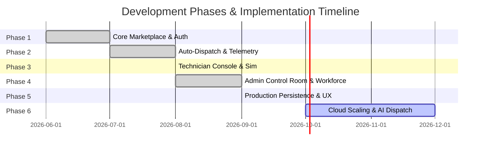

# 🗺️ Project Phases & Implementation Roadmap

**Project Name:** Argent Your / Emergency Home Services Auto-Dispatch System  
**Document Version:** 2.0.0  
**Current Milestone:** Phase 5 Completed · Production Hardening & Roadmap Active  
**Last Updated:** September 2026

---

## Executive Phase Overview

---

## Detailed Phase Breakdown

### Phase 1: Core Marketplace & Consumer Foundation

- **Status:** `COMPLETED`
- **Primary Goal:** Establish the consumer-facing "Argent Your" doorstep marketplace catalog, search system, and customer authentication.
- **Key Deliverables:**
  - Full-service catalog across 8 categories (Plumbing, Electrical, HVAC, Cleaning, Salon & Spa, Carpentry, Painting, Smart Home).
  - Dynamic debounced search with synset/synonym matching.
  - Interactive multi-item cart drawer with quantity counters.
  - Multi-step booking checkout with appointment scheduling, addresses, and coupon codes.
  - Customer Profile dashboard with addresses, payment methods, saved items, and settings.
  - JWT authentication and dynamic OTP verification via Email / Phone number.

---

### Phase 2: Algorithmic Auto-Dispatch Engine & Real-Time Tracking

- **Status:** `COMPLETED`
- **Primary Goal:** Replace manual dispatch with algorithmic proximity matching and live GPS vehicle tracking.
- **Key Deliverables:**
  - Backend Dispatch Engine executing Haversine distance calculations and skill filtering.
  - Priority speed multipliers adjusting arrival ETAs for `Critical`, `High`, and `Normal` emergencies.
  - Socket.io bidirectional event bus with room segmentation (`user_{id}`, `tech_{id}`, `role_admin`).
  - Interactive Leaflet OpenStreetMap live tracking view with vehicle icons, radar beacons, dynamic connecting polylines, and real-time ETA countdowns.
  - Post-completion 5-star rating and review modal.

---

### Phase 3: Field Specialist Console & Live Telemetry Simulator

- **Status:** `COMPLETED`
- **Primary Goal:** Provide an intuitive mobile console for field professionals to manage shifts, accept dispatches, and broadcast telemetry.
- **Key Deliverables:**
  - Shift availability switcher (`ONLINE & READY` vs `OFFLINE`).
  - Emergency assignment popup with audible alert and a **45-second countdown timer**.
  - Cascading reassignment loop automatically re-routing requests if the timer expires or candidate declines.
  - **Live GPS Movement Simulator**: animates vehicle driving along the route, streaming coordinates over WebSockets to update customer and admin maps live.
  - Turn-by-turn workflow progression (`Accept` $\rightarrow$ `En Route` $\rightarrow$ `Arrive` $\rightarrow$ `Complete`).

---

### Phase 4: Admin Operations Control Room & Fleet Management

- **Status:** `COMPLETED`
- **Primary Goal:** Empower operational supervisors with citywide situational awareness and workforce oversight.
- **Key Deliverables:**
  - Fullscreen Operations Control Room showing all technicians (color-coded by availability) and active incidents.
  - Real-time KPI summary cards: Active Emergencies, Average Response Time, Dispatch Accuracy (%), Technician Utilization Rate (%).
  - Manual Dispatch Override functionality allowing supervisors to force-assign any emergency to any technician.
  - Workforce roster with remote shift toggles, certification tags, and performance histories.
  - Service history modal with complete auditable timestamp logs.

---

### Phase 5: Production Data Persistence & Desktop/Mobile UX Hardening

- **Status:** `COMPLETED`
- **Primary Goal:** Eradicate all demo resets, implement user-scoped persistence, and polish desktop and mobile layouts according to modern standards.
- **Key Deliverables:**
  - Client state synchronization layer (`client/src/services/userStore.js`) backing all bookings, cart items, notifications, and reviews in SQLite (`dispatch.db`) and user-scoped `localStorage`.
  - Zero fake/demo data guarantee: empty collections remain clean (`[]`); refreshing never generates phantom orders or notifications.
  - Direct `tel:` links and contextual `sms:` pre-filled messages on technician contact cards.
  - Technician rating persistence updating fleet average scores in SQLite.
  - **Desktop Navbar Polish:** Refined floating glassmorphism navbar to `h-[66px]`, `max-w-[1440px]`, large search bar, and strict logged-out display (Logo + Search + Sign In button only).
  - **Mobile Ergonomics:** Automatic top header suppression on internal sub-pages, and mobile bottom navigation active-tab tap-to-reload functionality.

---

### Phase 6: Cloud Scaling, Real SMS Gateways & AI Dispatch Optimization

- **Status:** `PLANNED / ROADMAP`
- **Primary Goal:** Transition from embedded single-node architecture to distributed cloud infrastructure with predictive dispatching.
- **Planned Workstreams:**
  - **Cloud Infrastructure:** Docker containerization, Kubernetes / Google Cloud Run deployment, PostgreSQL / CockroachDB cluster migration.
  - **Production SMS / Email:** Production Twilio SMS and SendGrid email API credentials for live carrier-network OTP and dispatch notifications.
  - **Traffic-Aware Routing:** Integration with Google Maps Platform / OSRM routing engine for real-world live traffic congestion delays.
  - **AI-Powered Predictive Dispatch:** Machine learning models forecasting localized incident surge windows based on weather patterns, neighborhood infrastructure age, and historical emergency calls.
  - **Native Mobile Apps:** React Native / Flutter wrappers for field technicians with background GPS tracking and push notifications (APNs / FCM).
