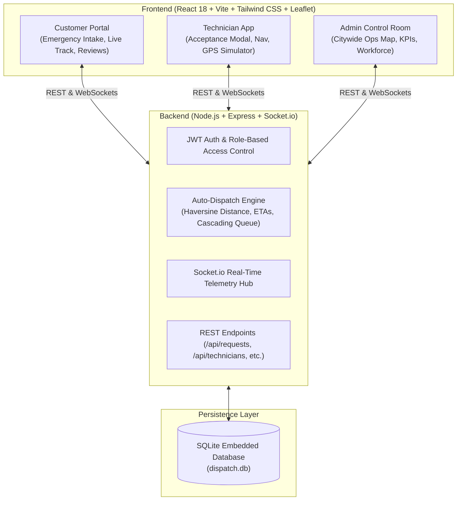

# 🚨 Emergency Home Services Auto-Dispatch System

An enterprise-grade, real-time automated dispatch platform for emergency home services (Plumbing, Electrical, HVAC, Gas Leaks, Locksmith, Appliance Malfunctions). The system replaces slow, manual phone dispatching with an algorithmic dispatch engine that continuously identifies the fastest available technician based on real-time GPS location, travel ETA, skill certification, and current workload.

---

## 📌 Problem Statement & Solution

| Traditional Emergency Dispatch                           | Our Auto-Dispatch System                                        |
| -------------------------------------------------------- | --------------------------------------------------------------- |
| ❌ Manual phone assignment & coordination delays         | ⚡ Automated instant match based on proximity & availability    |
| ❌ 34+ minutes average customer wait time                | ⚡ **< 12.3 minutes** average response time (**64% reduction**) |
| ❌ Zero visibility into technician whereabouts           | 🗺️ Live real-time GPS tracking with dynamic ETA countdown       |
| ❌ Lost requests when a technician is unavailable        | 🔄 Automatic cascading reassignment with 45s acceptance timer   |
| ❌ Fragmented paper logs & lack of operational oversight | 📊 Centralized Admin Control Room with live KPIs and audit logs |

---

## 🏗️ System Architecture



---

## 🚀 Key Functional Modules & Interconnected Pages

The platform features **8 interconnected functional pages**:

1. **Authentication & Instant Demo Launchpad (`/login`)**
   - Role-Based Access Control (RBAC) with JWT authentication.
   - **1-Click Instant Evaluation Switcher**: Pre-configured buttons to jump directly into **Customer**, **Plumber Pro**, **Electrician Pro**, **HVAC Pro**, or **Admin Supervisor** without typing credentials.
2. **Customer Emergency Request Module (`/customer-request`)**
   - Category selector with visual badges (Plumbing, Electrical, HVAC, Appliance, Locksmith, Gas Leak).
   - Priority level selection: `Critical` (immediate danger/flooding), `High`, `Medium`.
   - GPS Auto-Detection & **Interactive Map Pin Picker** (click anywhere on the map to pinpoint exact emergency location).
   - Pre-loaded emergency incident descriptions and photo attachment simulation.
3. **Real-Time Live Tracking Page (`/live-tracking`)**
   - Interactive Leaflet OpenStreetMap showing customer emergency beacon and technician vehicle marker connected by a dynamic route polyline.
   - Live ETA countdown timer that adjusts dynamically based on technician movement.
   - Lifecycle Status Stepper: `Requested` $\rightarrow$ `Auto-Dispatched` $\rightarrow$ `Accepted` $\rightarrow$ `En Route` $\rightarrow$ `Arrived` $\rightarrow$ `In Progress` $\rightarrow$ `Completed`.
   - Direct connect buttons (Call Unit, Live In-App Chat).
   - Post-completion 5-star rating and feedback review modal with celebratory confetti.
4. **Technician Emergency Console (`/technician-dashboard`)**
   - Shift status toggle (`ONLINE & READY` vs `OFFLINE`).
   - Emergency dispatch alert popup with loud two-tone audio alert and **45-second countdown timer** to Accept or Decline.
   - Step-by-step active job workflow progression buttons.
   - **Live GPS Movement Simulator**: Clicking "Simulate Driving to Customer" animates the technician driving along the route, broadcasting real-time coordinates over WebSockets to update customer and admin maps live!
5. **Admin Operations Control Room (`/admin-dashboard`)**
   - Fullscreen Citywide Operations Map showing all technicians (color-coded by availability) and active emergency calls.
   - Real-time KPI Cards: Active Emergencies, Average Response Time, Dispatch Accuracy (%), Technician Utilization Rate (%).
   - Live incident queue with **Manual Dispatch Override** (force reassign any incident to any technician).
   - Real-time telemetry event stream.
6. **Technician Workforce Management (`/admin-workforce`)**
   - Roster of all certified technicians across the city.
   - Live status (Available, On Job, Offline), skill categories, ratings, completed emergency count, and GPS coordinates.
   - Remote shift toggling.
7. **Service History & Audit Trail (`/history`)**
   - Chronological list of past service requests with search and category/status filters.
   - Detailed modal showing the complete lifecycle transition log with exact timestamps and notes.
8. **Operational Analytics & KPI Reports (`/analytics`)**
   - Response time comparison against manual dispatch industry benchmarks.
   - Incident volume distribution by category and 24-hour peak windows.
   - Technician fleet leaderboard.
9. **User Profile & Dispatch Settings (`/profile`)**
   - Contact info, emergency phone, registered address, verified license credentials.

---

## 🧮 Auto-Dispatch Algorithm Details

When an emergency request is logged, the Auto-Dispatch Engine executes the following:

1. **Candidate Filtering**:
   $$\text{Eligible Candidates} = \{ t \in \text{Technicians} \mid t.\text{category} = \text{req}.\text{category} \land t.\text{is\_online} = 1 \land t.\text{is\_busy} = 0 \land t.\text{id} \notin \text{Excluded} \}$$
2. **Distance & ETA Calculation**:
   - Computes great-circle distance $d$ via Haversine formula.
   - Computes travel ETA based on priority speed limits:
     $$\text{ETA} = \left\lceil \frac{d}{\text{Speed}} \times 60 + \text{PrepTime} \right\rceil$$
3. **Composite Scoring**:
   $$\text{Score} = \left( \frac{100}{1 + 0.8 \cdot d} \right) + (12 \cdot \text{Rating}) + \min(0.1 \cdot \text{Jobs}, 10)$$
4. **Offer & Countdown**:
   - The top candidate receives a targeted WebSocket offer with a **45-second acceptance timer**.
5. **Cascading Reassignment**:
   - If the technician declines or does not respond within 45s, the engine adds the technician to `excludedTechIds` and immediately cascades the dispatch offer to the next highest-scoring candidate.
   - If all nearby candidates are exhausted, the request automatically escalates to the **Admin Control Room** for supervisor override.

---

## 💻 Tech Stack

- **Frontend**: React 18, Vite, Tailwind CSS, Lucide React, Leaflet & React-Leaflet, Socket.io-client, Axios, Canvas-Confetti.
- **Backend**: Node.js, Express.js, Socket.io, SQLite3 (`dispatch.db`), JSONWebTokens, Bcryptjs, UUID.
- **Tools**: Concurrently (run full stack with single command).

---

## ⚡ Quick Start Instructions

### Prerequisites

- Node.js (v18+)
- npm (v9+)

### Installation & Run

1. **Install Dependencies (Root, Server, and Client)**:

   ```bash
   npm run install:all
   ```

2. **Seed Initial Database**:

   ```bash
   npm run seed
   ```

   _(Seeds realistic demo customers, 6 certified technicians with Delhi NCR GPS coordinates, and historical completed requests)_

3. **Start Full-Stack Development Server**:

   ```bash
   npm run dev
   ```

   - **Frontend UI**: [http://localhost:3000](http://localhost:3000)
   - **Backend API**: [http://localhost:5000](http://localhost:5000)
   - **WebSocket Hub**: [http://localhost:5000](http://localhost:5000)

---

## 🔑 Demo Login Credentials

You can use the **1-Click Demo Switcher** directly on the Login page or in the top navigation bar, or manually sign in with:

| Role                        | Name                   | Email                     | Password      |
| --------------------------- | ---------------------- | ------------------------- | ------------- |
| **Admin Supervisor**        | Chief Dispatch Officer | `admin@demo.com`          | `admin123`    |
| **Customer**                | Michael Sterling       | `customer@demo.com`       | `customer123` |
| **Customer**                | Sarah Jenkins          | `sarah@demo.com`          | `customer123` |
| **Technician (Plumbing)**   | Alex Rivera            | `tech.plumber@demo.com`   | `tech123`     |
| **Technician (Electrical)** | David Chen             | `tech.electric@demo.com`  | `tech123`     |
| **Technician (HVAC)**       | Marcus Johnson         | `tech.hvac@demo.com`      | `tech123`     |
| **Technician (Locksmith)**  | Carlos Gomez           | `tech.locksmith@demo.com` | `tech123`     |
| **Technician (Gas Leak)**   | Samira Khan            | `tech.gas@demo.com`       | `tech123`     |
| **Technician (Appliance)**  | Elena Rostova          | `tech.appliance@demo.com` | `tech123`     |

---

## 🧪 Verification & Testing

To execute the automated smoke tests covering database seeding, Haversine geo calculations, auto-dispatch scoring, and status transition logs:

```bash
npm --prefix server run test:smoke || node server/test-smoke.js
```

---

## 🌐 Production Deployment

The project is structured for easy deployment to cloud platforms like **Render**, **Railway**, **AWS EC2**, or **Vercel**:

```bash
# Build the client into client/dist
npm run build

# Start production server (serves both REST API, WebSockets, and static client on port 5000)
npm --prefix server start
```
